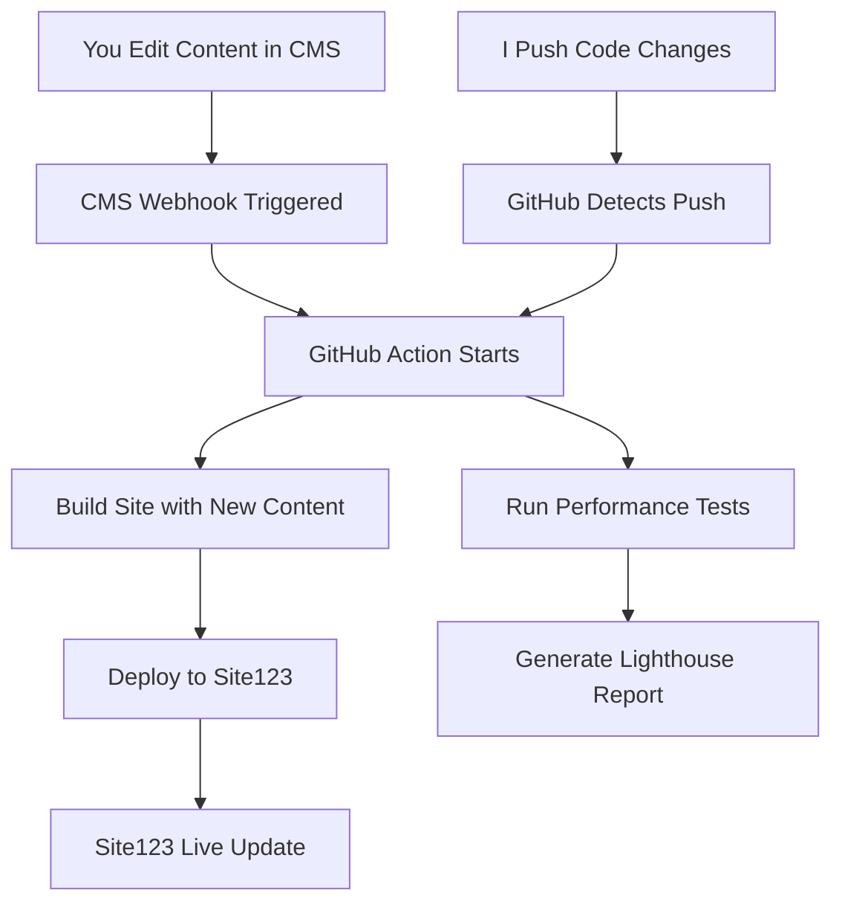

# 🚀 Complete Automation Workflow - Summary & Implementation Guide

## 🎯 **What You Get: Full Automation**

```
YOU edit content in CMS → Site automatically updates in 2-3 minutes
I push code changes → Site automatically updates in 2-3 minutes
```

## 📊 **CMS Options Comparison**

| Feature | Strapi (Recommended) | Contentful | Supabase |
|---------|---------------------|------------|----------|
| **User Interface** | ⭐⭐⭐⭐⭐ Visual admin | ⭐⭐⭐⭐⭐ Best UI | ⭐⭐⭐ Technical |
| **Cost** | $5-10/month | Free tier | Free tier |
| **Setup Difficulty** | ⭐⭐⭐ Medium | ⭐⭐⭐⭐⭐ Easy | ⭐⭐ Hard |
| **Customization** | ⭐⭐⭐⭐⭐ Full control | ⭐⭐⭐ Limited | ⭐⭐⭐⭐ Good |
| **Image Management** | ⭐⭐⭐⭐⭐ Built-in | ⭐⭐⭐⭐⭐ Excellent | ⭐⭐ Basic |
| **Real-time Updates** | ⭐⭐⭐ Good | ⭐⭐⭐ Good | ⭐⭐⭐⭐⭐ Excellent |

**Recommendation: Strapi** for best balance of features and control.

## 🔄 **Complete Automation Architecture**



## 📋 **Implementation Roadmap**

### **Phase 1: Choose & Setup CMS (1-2 hours)**

#### **Option A: Strapi (Recommended)**
```bash
# 1. Run setup script
npm run cms:setup:strapi

# 2. Create Strapi project
npx create-strapi-app@latest georesolve-cms --quickstart

# 3. Deploy to Railway
# - Connect GitHub repo to Railway
# - Auto-deploys on push

# 4. Configure content types
# - Import from generated cms-content-types.json
# - Add admin user
```

#### **Option B: Contentful (Easiest)**
```bash
# 1. Run setup script
npm run cms:setup:contentful

# 2. Create Contentful account
# - Sign up at contentful.com
# - Create content models for articles, projects

# 3. Get API credentials
# - Copy Space ID and Access Token
```

#### **Option C: Supabase (Free)**
```bash
# 1. Run setup script
npm run cms:setup:supabase

# 2. Create Supabase project
# - Sign up at supabase.com
# - Run generated database-schema.sql

# 3. Get API credentials
# - Copy Project URL and anon key
```

### **Phase 2: Configure GitHub Secrets (5 minutes)**

Go to GitHub repository → Settings → Secrets and variables → Actions:

#### **For Strapi:**
- `CMS_TYPE` = `strapi`
- `STRAPI_API_URL` = `https://your-app.railway.app/api`
- `STRAPI_TOKEN` = `your-api-token`

#### **For Contentful:**
- `CMS_TYPE` = `contentful`
- `CONTENTFUL_SPACE_ID` = `your-space-id`
- `CONTENTFUL_ACCESS_TOKEN` = `your-access-token`

#### **For Supabase:**
- `CMS_TYPE` = `supabase`
- `SUPABASE_URL` = `https://your-project.supabase.co`
- `SUPABASE_ANON_KEY` = `your-anon-key`

#### **Site123 Deployment (Optional - for full automation):**
- `SITE123_FTP_HOST` = `your-site123-ftp-host`
- `SITE123_FTP_USER` = `your-ftp-username`
- `SITE123_FTP_PASSWORD` = `your-ftp-password`
- `SITE123_URL` = `https://your-site123-domain.com`

### **Phase 3: Update Frontend Components (30 minutes)**

Replace static data with CMS data in components:

```typescript
// Before (static data)
const articles = [
  { title: "Article 1", content: "..." },
  // ...
];

// After (CMS data)
import { useNewsArticles } from '@/hooks/useCMS';

const { data: articles, loading } = useNewsArticles();
```

### **Phase 4: Test Complete Pipeline (15 minutes)**

1. **Add content in CMS**
2. **Trigger webhook** (automatic)
3. **Watch GitHub Action** build and deploy
4. **Verify Site123** shows new content

## 🛠️ **Management Experience for You**

### **Daily Content Management**

#### **Adding News Article:**
1. Open CMS dashboard (bookmark it)
2. Click "Articles" → "Add New"
3. Fill in:
   - Title
   - Content
   - Image (drag & drop upload)
   - Category, Location, Client
4. Click "Publish"
5. **Site123 updates automatically in 2-3 minutes**

#### **Adding New Project:**
1. Click "Projects" → "Add New"
2. Fill in project details
3. Upload project image
4. Set as "Featured" if desired
5. Click "Publish"
6. **Site123 updates automatically**

#### **Managing Images:**
- **Drag & drop** upload in CMS
- **Automatic optimization** and responsive sizing
- **CDN delivery** for fast loading

### **What You Never Need to Do:**
- ❌ Manual file uploads to Site123
- ❌ Code changes for content updates
- ❌ Image resizing or optimization
- ❌ Worrying about site building

## 🔧 **Available Commands**

```bash
# CMS Setup
npm run cms:setup                # Choose CMS interactively
npm run cms:setup:strapi         # Setup Strapi integration
npm run cms:setup:contentful     # Setup Contentful integration
npm run cms:setup:supabase       # Setup Supabase integration

# Deployment
npm run deploy:trigger           # Trigger deployment manually
npm run deploy:status           # Check deployment status
npm run webhook:test            # Test CMS webhook

# Development
npm run dev                     # Start development server
npm run build:production        # Build with CMS data
npm run performance:test        # Test site performance
```

## 📊 **Monitoring & Analytics**

### **Automatic Performance Monitoring**
- **Lighthouse tests** run on every deployment
- **Performance scores** tracked over time
- **Alerts** if performance degrades

### **Deployment Tracking**
- **Build logs** for every deployment
- **Version tags** for easy rollback
- **Deployment artifacts** downloadable for 30 days

## 💰 **Cost Breakdown**

### **Recommended Setup (Strapi + Railway)**
- **Railway hosting**: $5-10/month
- **Domain**: $10/year (if custom domain needed)
- **GitHub Actions**: Free (2000 minutes/month)
- **Site123**: Your existing plan
- **Total**: ~$5-10/month

### **Free Tier Setup (Contentful/Supabase)**
- **CMS**: Free tier (sufficient for most needs)
- **GitHub Actions**: Free tier
- **Site123**: Your existing plan
- **Total**: $0/month

## 🚀 **Next Steps - Choose Your Path**

### **🏃‍♂️ Quick Start (30 minutes)**
1. Run `npm run cms:setup:contentful`
2. Create Contentful account
3. Add GitHub secrets
4. Test with one article

### **⚡ Recommended (1 hour)**
1. Run `npm run cms:setup:strapi`
2. Deploy Strapi to Railway
3. Configure content types
4. Add GitHub secrets and FTP
5. Full automation testing

### **🔧 Custom (2 hours)**
1. Run `npm run cms:setup:supabase`
2. Setup database schema
3. Create admin interface
4. Full customization

## ✅ **Success Criteria**

You'll know it's working when:
- ✅ You can add content in CMS dashboard
- ✅ Site123 updates automatically within 3 minutes
- ✅ All images display correctly and responsively
- ✅ No manual deployment steps needed
- ✅ Version control tracks all changes

## 🎯 **Ready to Start?**

**I recommend starting with Contentful** for the quickest setup, then we can migrate to Strapi later if you want more control.

Which option would you like me to help you implement first?
